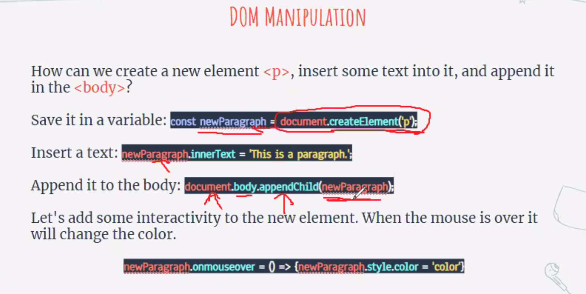
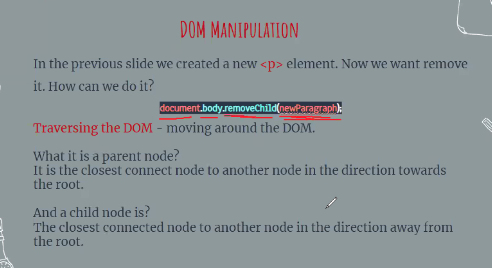
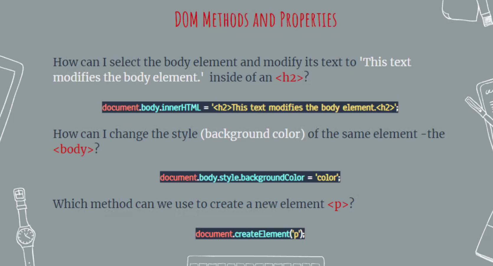
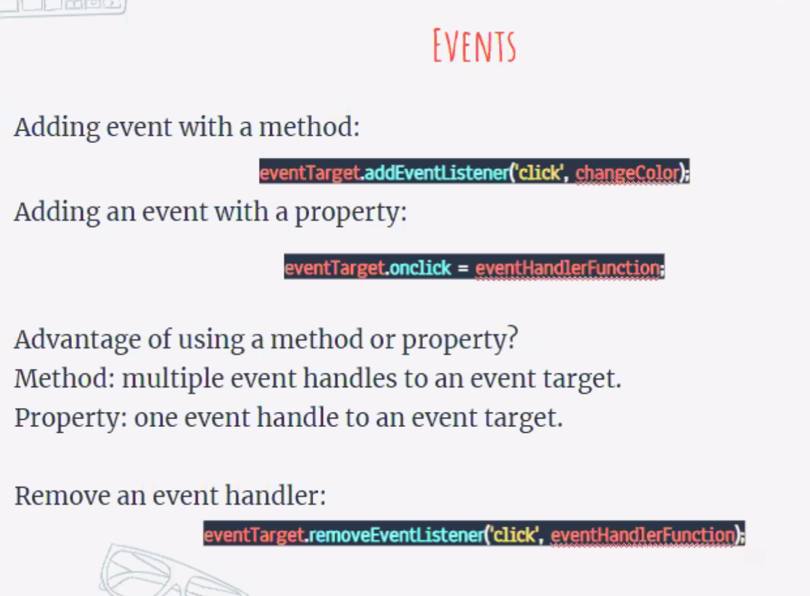

# The [DOM](https://developer.mozilla.org/en-US/docs/Web/API/Document_Object_Model) as a Tree Structure
- In the DOM tree, the top-most node is called the root node, and it represents the HTML document. The descendants of the root node are the HTML tags in the document, starting with the <html> tag followed by the <head> and <body> tags and so on.
  
- The diagram models the HTML document and labels the root element, which is the document.
  

--- 

## Parent Child Relationships in the DOM
- A parent node is any node that is a direct ancestor of another node.
  
- A child node is a direct descendant of another node, called the parent node.
  
--- 
## Nodes and Elements in the DOM
- A node is the equivalent of each family member in a family tree. A node is an intersecting point in a tree that also contains data.
  
- There are multiple types of node objects in the DOM tree. In our diagram, the node objects with the sharp-edge rectangles are [Element](https://developer.mozilla.org/en-US/docs/Web/API/Element) nodes, while the rounded edge rectangles are [Text](https://developer.mozilla.org/en-US/docs/Web/API/Text) nodes, because they represent the text inside the HTML paragraph elements.
  
- When trying to modify a web page, the script will mostly interact with the DOM element nodes and occasionally text nodes.

- In the diagram, the DOM element nodes are highlighted red. These correspond to elements in the HTML document.
  

---

## Attributes of Element Node
- Much like an element in an HTML page, the DOM allows us to access a node’s attributes, such as its class, id, and inline style.
  
- In the diagram, we have highlighted the paragraph element with an id of 'bio' in the HTML document. If we were accessing that element node in our script, the DOM would allow us to tweak each of those attributes, or simply access them to check their value in the code.
  

--- 

## The Document Keyword
- Here is a [comprehensive list](https://developer.mozilla.org/en-US/docs/Web/API/Document) of all document properties.
  
---
## Tweak an Element
- The .innerHTML property allows you to access and set the contents of an element.
  ```
  document.body.innerHTML = 'The cat loves the dog.';
  ```
  
- The .innerHTML property can also add any valid HTML elements.
  ```
  document.body.innerHTML = '<h2>This is a heading</h2>';
  ```
---
## Select and Modify Elements
- The .querySelector() method allows us to specify a CSS selector as a string and returns the first element that matches that selector.
  ``` 
   document.querySelector('p');
  ```
  
- The .getElementById() method allow us to access an element directly by its id.
  ```
   document.getElementById('bio').innerHTML = 'The description'; 
  ```

- There are also the .getElementsByClassName() and .getElementsByTagName() methods which return an array of elements, instead of just one element.
  
  ```
    // Set first element of .student class as 'Not yet registered'
    document.getElementsByClassName('student')[0].innerHTML = 'Not yet registered';
 
    // Set second <li> tag as 'Cedric Diggory'
    document.getElementsByTagName('li')[1].innerHTML = 'Cedric Diggory`;
  ```
---
## [Style an Element](https://developer.mozilla.org/en-US/docs/Web/CSS/CSS_Properties_Reference)
- The .style property of a DOM element provides access to the inline style of that HTML tag.

- The syntax follows an element.style.property format, with the property representing a CSS property.
  
  ```
  //selects the first element with a class of blue and assigns blue as the background-color:

   let blueElement = document.querySelector('.blue');
   blueElement.style.backgroundColor = 'blue';
  ``` 

- The DOM .style property does not implement a hyphen such as background-color, but rather camel case notation, backgroundColor.
  
- The following chaining syntax would also work:
   ```
    document.querySelector('.blue').style.fontFamily = 'Roboto';
   ```

---
## Traversing the DOM
- Each element has a .parentNode and .children property. The [.parentNode property](https://developer.mozilla.org/en-US/docs/Web/API/Node/parentNode) returns the parent of the specified element in the DOM hierarchy. Note that the document element is the root node so its .parentNode property will return null.
  
- The .children property returns an array of the specified element’s children. If the element does not have any children, it will return null.
  
```
<ul id='groceries'>
  <li id='must-have'>Toilet Paper</li>
  <li>Apples</li>
  <li>Chocolate</li>
  <li>Dumplings</li>
</ul>


let parentElement = document.getElementById('must-have').parentNode; // returns <ul> element
let childElements = document.getElementById('groceries').children; // returns an array of <li> elements
```
--- 

## [Create and Insert Elements](https://developer.mozilla.org/en-US/docs/Web/API/Document/createElement) 
- The .createElement() method creates a new element based on the specified tag name passed into it as an argument. However, it does not append it to the document. It creates an empty element with no inner HTML.
  ```
  //the .createElement() method takes 'p' as its argument which creates an empty <p> element and stores it as the paragraph variable

   let paragraph = document.createElement('p');
  ```
- We can assign values to the properties of the newly created element like how we’ve done previously with existing elements.
  
  ```
    // we use the .id property to assign 'info' as ID and the .innerHTML property to set 'The text inside the paragraph' as the content of the <p> element.

    paragraph.id = 'info'; 
    paragraph.innerHTML = 'The text inside the paragraph';
  ```

- The .appendChild() method will add a child element as the parent element’s last child node. The following code appends the "p" element stored in the paragraph variable to the document body.
  ```
   document.body.appendChild(paragraph);
  ```
---
## Remove an Element
- The .removeChild() method removes a specified child from a parent.
  
  ```
   //the .querySelector() method returns the first paragraph in the document. 
    
   let paragraph = document.querySelector('p');

   // the paragraph element is passed as an argument of the .removeChild() method chained to the parent of the paragraph—document.body. This removes the first paragraph from the document body. 

   document.body.removeChild(paragraph);
  ```
 - If you want to hide an element rather than completely deleting it, the [.hidden property](https://developer.mozilla.org/en-US/docs/Web/API/HTMLElement/hidden) allows you to hide it by setting the property as true or false:
   ```
    document.getElementById('sign').hidden = true;
   ```
---
## Add Click Interactivity
-  [Events](https://developer.mozilla.org/en-US/docs/Web/Events) can include anything from a click to a user mousing over an element. We will learn more about events in the upcoming DOM Events with JavaScript lesson.

- The .onclick property allows you to assign a function to run on when a click event happens on an element:
  ```
    let element = document.querySelector('button');
 
    element.onclick = function() { 
    element.style.backgroundColor = 'blue' 
    };
  ``` 
- You can also assign the .onclick property to a function by name:
  ```
   //when the <button> element detects a click event, the backgroundColor will change to 'blue'.
   
   let element = document.querySelector('button');
 
   function turnBlue() {
   element.style.backgroundColor = 'blue';
   }
 
   element.onclick = turnBlue;

  ```
---
# DOM Event Handler Registration
- Using the .addEventListener() method, we can have a DOM element listen for a specific event and execute a block of code when the event is detected. 
  
- The DOM element that listens for an event is called the event target and the block of code that runs when the event happens is called the event handler.

```
 let eventTarget = document.getElementById('targetElement');
 
  eventTarget.addEventListener('click', function() {
  // this block of code will run when click event happens on eventTarget element
  });


  function eventHandlerFunction() {
  // this block of code will run  when click event happens
  }
 
  eventTarget.addEventListener('click', eventHandlerFunction);
```
- We used the .addEventListener() method on the eventTarget DOM element.

- The .addEventListener() method takes two arguments: an event name in string format and an event handler function.
  
- We used the 'click' event, which fires when the user clicks on eventTarget.

- The code block in the event handler function will execute when the 'click' event is detected.

- The named function eventHandlerFunction is passed as the second argument of the .addEventListener() method instead of defining an anonymous function within the method!
---

## Adding Event Handlers
- Event Handlers can also be registered by setting an .onevent property on a DOM element (event target). 
  
- we give the DOM element eventTarget the [.onclick property](https://developer.mozilla.org/en-US/docs/Web/API/GlobalEventHandlers/onclick) and set its value as the event handler function eventHandlerFunction.
  
```
  eventTarget.onclick = eventHandlerFunction;
```

- This .onevent property and .addEventListener() will both register event listeners.
   - With .onevent, it allows for one event handler function to be attached to the event target.
   - With the .addEventListener() method , we can add multiple event handler functions. 

- Examples:
  
  
  
---
## Removing Event Handlers
- The .removeEventListener() method is used to reverse the .addEventListener() method.
- This method stops the event target from “listening” for an event to fire when it no longer needs to.
  
- The .removeEventListener() also takes two arguments:
  1. The event type as a string
   
  2. The event handler function

 ```
  eventTarget.removeEventListener('click',  eventHandlerFunction);
 ```
- Because there can be multiple event handler functions associated with a particular event, .removeEventListener() needs both the exact event type name and the name of the event handler you want to remove.
  
- If .addEventListener() was provided an anonymous function, then that event listener cannot be removed.

- Examples:
  
  
---
## [Event Object Properties](https://developer.mozilla.org/en-US/docs/Web/API/Event)
- JavaScript stores events as Event objects with their related data and functionalities as properties and methods.
  
- When an event is triggered, the event object can be passed as an argument to the event handler function.
```
  function eventHandlerFunction(event){
   console.log(event.timeStamp);
   }
 
   eventTarget.addEventListener('click',eventHandlerFunction);
```
- There are pre-determined properties associated with event objects. You can call these properties to see information about the event, for example:
  - The [.target property](https://developer.mozilla.org/en-US/docs/Web/API/Event/target) to reference the element that the event is registered to.
  
  - The [.type property](https://developer.mozilla.org/en-US/docs/Web/API/Event/type) to access the name of the event.
  
  - The [.timeStamp property](https://developer.mozilla.org/en-US/docs/Web/API/Event/timeStamp) to access the number of milliseconds that passed since the document loaded and the event was triggered.

- Examples:
  
  
  
---
## Event Types
- Browsers can fire many other events without a user — you can check out a list of events on the [MDN Events Reference](https://developer.mozilla.org/en-US/docs/Web/Events) page.

- Many events need user interaction with the DOM to fire. One user interaction event you’ve become familiar with is the click event.
  
- [The onwheel event handler](https://developer.mozilla.org/en-US/docs/Web/API/GlobalEventHandlers/onwheel) that fires when you rotate the mouse wheel or slide down on the mousepad.
  
- Examples:
  
  
---
## Mouse Events
- The mousedown event is fired when the user presses a mouse button down.
  
- The mouseup event is fired when the user releases the mouse button.
  
- The mouseover event is fired when the mouse enters the content of an element.
  
- The mouseout event is fired when the mouse leaves an element.
  
- Examples:
  


---
## Keyboard Events
- The keydown event is fired while a user presses a key down.
  
- The keyup event is fired while a user releases a key.
  
- The keypress event is fired when a user presses a key down and releases it. This is different from using keydown and keyup events together, because those are two complete events and keypress is one complete event.
  
- Keyboard events have unique properties assigned to their event objects like the .key property that stores the values of the key pressed by the user. You can program the event handler function to react to a specific key, or react to any interaction with the keyboard.
---
## **Review**
- You can register events to DOM elements using the addEventListener() method.
  
- The addEventListener() method takes two arguments: an event type and an event handler function.
  
- When an event is triggered on the event target, the registered event handler function executes.
  
- Event handler functions can also be registered as values of onevent properties of their event target.
  
- Event object properties like .target, .type, and .timeStamp are used to provide information about the event.

- The addEventListener() method can be used to add multiple event handler functions to a single event.
  
- The removeEventListener() method stops specific event handlers from “listening” for specific events firing.

