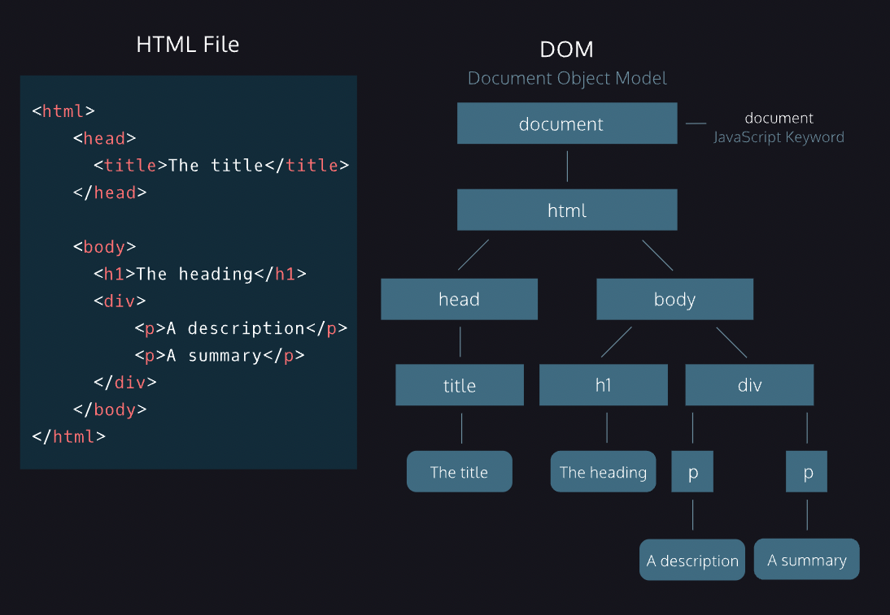
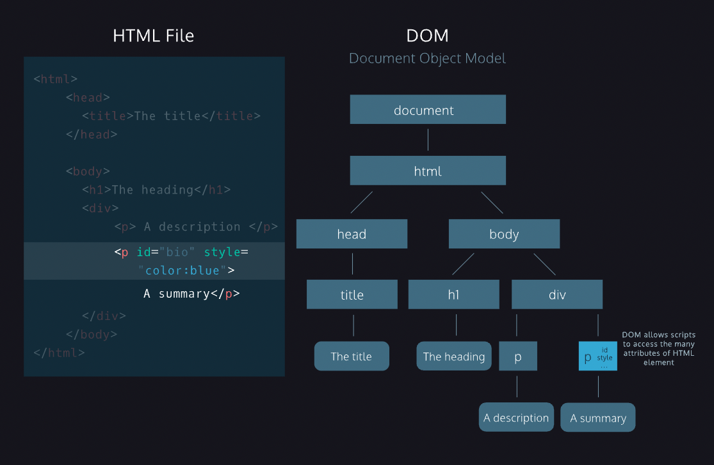

# The DOM as a Tree Structure
- In the DOM tree, the top-most node is called the root node, and it represents the HTML document. The descendants of the root node are the HTML tags in the document, starting with the <html> tag followed by the <head> and <body> tags and so on.
  
- The diagram models the HTML document and labels the root element, which is the document.
  

--- 

## Parent Child Relationships in the DOM
- A parent node is any node that is a direct ancestor of another node.
  
- A child node is a direct descendant of another node, called the parent node.
  
--- 
## Nodes and Elements in the DOM
- A node is the equivalent of each family member in a family tree. A node is an intersecting point in a tree that also contains data.
  
- There are multiple types of node objects in the DOM tree. In our diagram, the node objects with the sharp-edge rectangles are [Element](https://developer.mozilla.org/en-US/docs/Web/API/Element) nodes, while the rounded edge rectangles are [Text](https://developer.mozilla.org/en-US/docs/Web/API/Text) nodes, because they represent the text inside the HTML paragraph elements.
  
- When trying to modify a web page, the script will mostly interact with the DOM element nodes and occasionally text nodes.

- In the diagram, the DOM element nodes are highlighted red. These correspond to elements in the HTML document.
  

---

## Attributes of Element Node
- Much like an element in an HTML page, the DOM allows us to access a node’s attributes, such as its class, id, and inline style.
  
- In the diagram, we have highlighted the paragraph element with an id of 'bio' in the HTML document. If we were accessing that element node in our script, the DOM would allow us to tweak each of those attributes, or simply access them to check their value in the code.
  

--- 