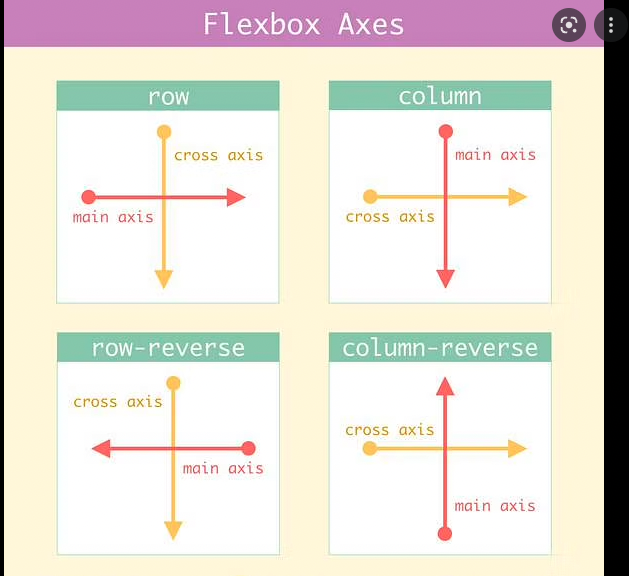

# **FLEXBOX Concepts**

- display: flex changes an element to a block-level container with flex items inside of it.
  
- display: inline-flex allows multiple flex containers to appear inline with each other.
justify-content is used to space items along the main axis.

- Flex containers can be nested inside of each other by declaring display: flex or display: inline-flex for children of flex containers.

---

## Flex containers (parent)
- justify-content is used to position the items from left to right, we use a property
  
- align-items is used to space flex items along the cross (column) axis.(align a single row)
  
- align-content is used to space rows along the cross (column) axis.(align mutiple rows)
  
- flex-wrap specifies that elements should shift along the cross axis if the flex container is not large enough.
  
- flex-direction is used to specify the main (row) and cross (column) axes.
  
- flex-flow is used to specify flex-wrap and flex-direction in one declaration.
 
---
## Flex items (children)
- flex-grow is used to specify how much space (and in what proportions) flex items absorb along the main axis.
  
- flex-shrink is used to specify how much flex items shrink and in what proportions along the main axis.

- flex-basis is used to specify the initial size of an element styled with flex-grow and/or flex-shrink.
  
- flex is used to specify flex-grow, flex-shrink, and flex-basis in one declaration.

---

  

