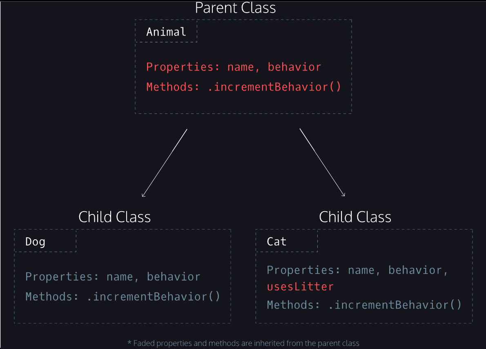

# Classes

### JavaScript is an object-oriented programming (OOP) language we can use to model real-world items
---
### Introduction to Classes
```
class Dog {

  //Create constructor
  constructor(name) {
    this._name = name;
    this._behavior = 0;
  }


  // Methods, no commas between them

  get name() {
    return this._name;
  }
  get behavior() {
    return this._behavior;
  }   

  incrementBehavior() {
    this._behavior ++;
  }
}


//Instance
const halley = new Dog('Halley'); // Create new Dog instance and name "Hally".


//Method Calls
console.log(halley.name); // Print name value to console
console.log(halley.behavior); // Print behavior value to console


halley.incrementBehavior(); // Add one to behavior
console.log(halley.name); // Print name value to console
console.log(halley.behavior); // Print behavior value to console
```
--- 
#### Constructor
- Dog is the name of our class. By convention, we capitalize and CamelCase class names.
  
- JavaScript calls the constructor() method every time it creates a new instance of a class.
  
- Created a class called Dog, and used it to produce a Dog object.
  
- This constructor() method accepts one argument, name.
  
- Inside of the constructor() method, we use the this keyword. In the context of a class, this refers to an instance of that class. In the Dog class, we use this to set the value of the Dog instance’s name property to the name argument.
  
- Under this.name, we create a property called behavior, which will keep track of the number of times a dog misbehaves. The behavior property is always initialized to zero.

---
#### Instance
- Below our Dog class, we use the new keyword to create an instance of our Dog class.
  
- We create a new variable named halley that will store an instance of our Dog class.
  
- We use the new keyword to generate a new instance of the Dog class. The new keyword calls the constructor(), runs the code inside of it, and then returns the new instance.

- We pass the 'Halley' string to the Dog constructor, which sets the name property to 'Halley'.
  
- Finally, we log the value saved to the name key in our halley object, which logs 'Halley' to the console.

---

#### Methods
- we add getter methods for name and behavior
  
- Notice, we also prepended our property names with underscores (_name and _behavior), which indicate these properties should not be accessed directly.
  
- Under the getters, we add a method named .incrementBehavior().
  
- When you call .incrementBehavior() on a Dog instance, it adds 1 to the _behavior property. Between each of our methods, we did not include commas.

---

### Method Calls
##### Let’s take a moment to create two Dog instances and call our .incrementBehavior() method on one of them.

```
let nikko = new Dog('Nikko'); // Create dog named Nikko

nikko.incrementBehavior(); // Add 1 to nikko instance's behavior

let bradford = new Dog('Bradford'); // Create dog name Bradford

console.log(nikko.behavior); // Logs 1 to the console

console.log(bradford.behavior); // Logs 0 to the console
```

- we create two new Dog instances, nikko and bradford。
  
- Because we increment the behavior of our nikko instance, but not bradford, accessing nikko.behavior returns 1 and accessing bradford.behavior returns 0.

--- 

### Inheritance I
-  When multiple classes share properties or methods, they become candidates for inheritance — a tool developers use to decrease the amount of code they need to write.
  
- With inheritance, you can create a parent class (also known as a superclass) with properties and methods that multiple child classes (also known as subclasses) share. The child classes inherit the properties and methods from their parent class.

### Let’s abstract the shared properties and methods from our Cat and Dog classes into a parent class called Animal.
```

//parent class called Animal
class Animal {
  constructor(name) {
    this._name = name;
    this._behavior = 0;
  }
 
  get name() {
    return this._name;
  }
 
  get behavior() {
    return this._behavior;
  }   
 
  incrementBehavior() {
    this._behavior++;
  }
} 


//Child class Cat
class Cat {
  constructor(name, usesLitter) {
    this._name = name;
    this._usesLitter = usesLitter;
    this._behavior = 0;
  }
 
  get name() {
    return this._name;
  }
 
  get usesLitter() {
    return this._usesLitter;
  }
 
  get behavior() {
    return this._behavior;
  }  
 
  incrementBehavior() {
    this._behavior++;
  }
}

```

- In the example above, the Animal class contains the properties and methods that the Cat and Dog classes share (name, behavior, .incrementBehavior()).

- The diagram shows the relationships we want to create between the Animal, Cat, and Dog classes.
  
  

---

### Inheritance III
- Now that we have these shared properties and methods in the parent Animal class, we can extend them to the subclass, Cat.

```
class Cat extends Animal {
  constructor(name, usesLitter) {
    super(name);
    this._usesLitter = usesLitter;
  }
}

//create a new Cat instance and call its name with the same syntax as we did with the Dog class:
 
const bryceCat = new Cat('Bryce', false); 
console.log(bryceCat._name); // output: Bryce

```
  - In the example above, we create a new class named Cat that extends the Animal class. Let’s pay special attention to our new keywords: extends and super.
  
  - The **extends** keyword makes the methods of the animal class available inside the cat class.

  - The constructor, called when you create a new Cat object, accepts two arguments, name and usesLitter.

  - The **super** keyword calls the constructor of the parent class. In this case, super(name) passes the name argument of the Cat class to the constructor of the Animal class. When the Animal constructor runs, it sets this._name = name; for new Cat instances.

  - _usesLitter is a new property that is unique to the Cat class, so we set it in the Cat constructor.

  - Notice, we call super on the first line of our constructor(), then set the usesLitter property on the second line. In a constructor(), you must always call the super method before you can use the this keyword — if you do not, JavaScript will throw a reference error. To avoid reference errors, it is best practice to call super on the first line of subclass constructors.
- We pass it 'Bryce' and false for our name and usesLitter arguments.
  
- When we call console.log(bryceCat._name) our program prints, Bryce.
---
### Inheritance IV
- When we call extends in a class declaration, all of the parent methods are available to the child class.
```
class Animal {
  constructor(name) {
    this._name = name;
    this._behavior = 0;
  }
 
  get name() {
    return this._name;
  }
 
  get behavior() {
    return this._behavior;
  }
 
  incrementBehavior() {
    this._behavior++;
  }
} 
 
 
class Cat extends Animal {
  constructor(name, usesLitter) {
    super(name);
    this._usesLitter = usesLitter;
  }
}
 
const bryceCat = new Cat('Bryce', false);

// the code logs 'Bryce' to the console.
console.log(bryceCat.name);

// Call .incrementBehavior() on Cat instance 
bryceCat.incrementBehavior(); 

// Log value saved to behavior, the answer is 1, use parent incrementBehavior()method
console.log(bryceCat.behavior); 

``` 
- The Cat class has access to the Animal getters and the .incrementBehavior() method.

- we create a Cat instance named bryceCat. Because bryceCat has access to the name getter, the code below logs 'Bryce' to the console.

- Since the extends keyword brings all of the parent’s getters and methods into the child class, bryceCat.name accesses the name getter and returns the value saved to the name property.

---
### Inheritance V
- In addition to the inherited features, child classes can contain their own properties, getters, setters, and methods.
- we will add a usesLitter getter. The syntax for creating getters, setters, and methods is the same as it is in any other class.

```
class Cat extends Animal {
  constructor(name, usesLitter) {
    super(name);
    this._usesLitter = usesLitter;
  }
 
  get usesLitter() {
    return this._usesLitter;
  }
}
```
---
### Static Methods
- Sometimes you will want a class to have methods that aren’t available in individual instances, but that you can call directly from the class.
- Let’s see how to use the static keyword to create a static method called generateName method in our Animal class:
```
class Animal {
  constructor(name) {
    this._name = name;
    this._behavior = 0;
  }
 
  static generateName() {
    const names = ['Angel', 'Spike', 'Buffy', 'Willow', 'Tara'];
    const randomNumber = Math.floor(Math.random()*5);
    return names[randomNumber];
  }
} 

// call the .generateName() method
console.log(Animal.generateName()); // returns a name

//Cannot access from instances of the any class
const tyson = new Animal('Tyson'); 
tyson.generateName(); // TypeError
```
-  we create a static method called .generateName() that returns a random name when it’s called. Because of the static keyword, we can only access .generateName() by appending it to the Animal class.

- You cannot access the .generateName() method from instances of the Animal class or instances of its subclasses.

---
## Review: Classes
- Classes are templates for objects.
- Javascript calls a constructor method when we create a new instance of a class.
- Inheritance is when we create a parent class with properties and methods that we can extend to child classes.
- We use the extends keyword to create a subclass.
- The super keyword calls the constructor() of a parent class.
Static methods are called on the class, but not on instances of the class.