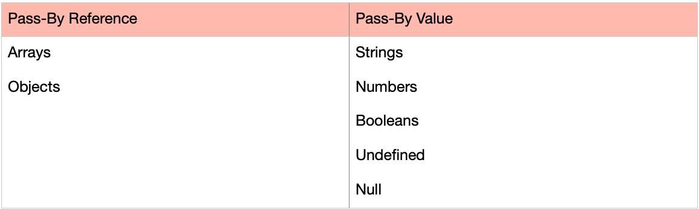

## Pass-By Value vs. Pass-By Reference



- The difference between pass-by-reference and pass-by-value is, pass-by-value creates a new space in memory and **makes a copy of a value**, whereas pass-by-reference does not. 
  
- **Pass By Value:** In Pass by value, function is called by directly passing the value of the variable as an argument. So any changes made inside the function does not affect the original value.
  
- In Pass by value, parameters passed as an arguments create its own copy. So any changes made inside the function is made to the copied value not to the original value .
```
 function Passbyvalue(a, b) {
	let tmp;
	tmp = b;
	b = a;
	a = tmp;
	console.log(`Inside Pass by value
		function -> a = ${a} b = ${b}`);
}

let a = 1;
let b = 2;
console.log(`Before calling Pass by value
		Function -> a = ${a} b = ${b}`);

Passbyvalue(a, b);

console.log(`After calling Pass by value
	Function -> a =${a} b = ${b}`);


//Output:
Before calling Pass by value Function -> a = 1 b = 2
Inside Pass by value function -> a = 2 b = 1
After calling Pass by value Function -> a =1 b = 2

```
--- 
- Instead of making a copy, pass-by-reference does exactly what it sounds like; a value **stored in memory gets referenced**.

- **Pass by Reference**: In Pass by Reference, Function is called by directly passing the reference/address of the variable as an argument. So **changing the value inside the function also change the original value.** In JavaScript array and Object follows pass by reference property.

- In Pass by reference, parameters passed as an arguments does not create its own copy, it **refers to the original value so changes made inside function affect the original value. **

```
function PassbyReference(obj) {
	let tmp = obj.a;
	obj.a = obj.b;
	obj.b = tmp;

	console.log(`Inside Pass By Reference
		Function -> a = ${obj.a} b = ${obj.b}`);
}

let obj = {
	a: 10,
	b: 20

}
console.log(`Before calling Pass By Reference
	Function -> a = ${obj.a} b = ${obj.b}`);

PassbyReference(obj)

console.log(`After calling Pass By Reference
	Function -> a = ${obj.a} b = ${obj.b}`);

//Output
Before calling Pass By Reference Function -> a = 10 b = 20
Inside Pass By Reference Function -> a = 20 b = 10
After calling Pass By Reference Function -> a = 20 b = 10
```
---
### Example 1: Updating the object reference in the function.
```
function PassbyReference(obj) {
  
    // Changing the reference of the object
    obj = {
        a: 10,
        b: 20,
        c: "GEEKSFORGEEKS"
    }
    console.log(`Inside Pass by 
        Reference Function -> obj `);
          
    console.log(obj);
}
  
let obj = {
    a: 10,
    b: 20
  
}
console.log(`Updating the object reference -> `)
console.log(`Before calling Pass By 
        Reference Function -> obj`);
console.log(obj);
  
PassbyReference(obj)
console.log(`After calling Pass By 
        Reference Function -> obj`);
console.log(obj);


//Output
Updating the object reference -> 
Before calling PassByReference Function -> obj
{a: 10, b: 20}
Inside PassbyReference Function -> obj 
{a: 10, b: 20, c: "GEEKSFORGEEKS"}
After calling PassByReference Function -> obj
{a: 10, b: 20}
```
---
### Example 2: Mutating the original Object.
```
function PassbyReference(obj) {

	// Mutating the origanal object
	obj.c = "GEEKSFORGEEKS";
	console.log(`Inside Pass by
		Reference Function -> obj `);
	console.log(obj);
}

let obj = {
	a: 10,
	b: 20

}
console.log(`Mutating the origanal object -> `)
console.log(`Before calling Pass By
		Reference Function -> obj`);
console.log(obj);

PassbyReference(obj)
console.log(`After calling Pass By
		Reference Function -> obj`);
console.log(obj);

//Output:
Mutating the origanal object -> 
Before calling PassByReference Function -> obj
{a: 10, b: 20}
Inside PassbyReference Function -> obj 
{a: 10, b: 20, c: "GEEKSFORGEEKS"}
After calling PassByReference Function -> obj
{a: 10, b: 20, c: "GEEKSFORGEEKS"}
```
