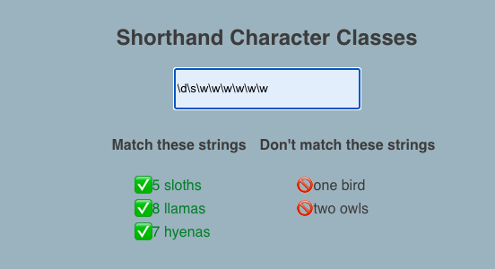
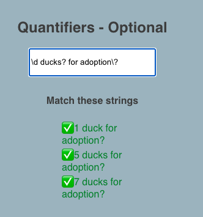

# [Regular expressions](https://www.w3schools.com/js/js_regexp.asp)
- A regular expression is a special sequence of characters that describe a pattern of text that should be found, or matched, in a string or document.
  
-  By matching text, we can identify how often and where certain pieces of text occur, as well as have the opportunity to replace or update these pieces of text if needed.
  
- Regular Expressions have a variety of use cases including:
  - validating user input in HTML forms
  - verifying and parsing text in files, code and applications
  - examining test results
  - finding keywords in emails and web pages
---
### Literals
- The simplest text we can match with regular expressions are **literals**.

- The regex a, for example, will match the text a, and the regex bananas will match the text bananas.

- Not only are we able to match alphabetical characters — digits work as well! The regex 3 will match the 3 in the piece of text 34, and the regex 5 gibbons will completely match the text 5 gibbons!
  
- Regular expressions operate by moving character by character, from left to right, through a piece of text. When the regular expression finds a character that matches the first piece of the expression, it looks to find a continuous sequence of matching characters.
---
### Alternation
- **Alternation**, performed in regular expressions with the pipe symbol, |, allows us to match either the characters preceding the | OR the characters after the |.
  
- The regex baboons|gorillas will match baboons in the text I love baboons, but will also match gorillas in the text I love gorillas.
---
### Character Sets
- **Character sets**, denoted by a pair of brackets [], let us match one character from a series of characters, allowing for matches with incorrect or different spellings.
  
- The beauty of character sets (and alternation) is that they allow our regular expressions to become more flexible and less rigid than by just matching with literals!
  
- We can make our character sets even more powerful with the help of the caret ^ symbol. Placed at the front of a character set, the ^ negates the set, matching any character that is not stated.
  
- These are called negated character sets. Thus the regex [^cat] will match any character that is not c, a, or t, and would completely match each character d, o or g.

- Example:
 

---
### Wild for Wildcards
- Sometimes we don’t care exactly WHAT characters are in a text, just that there are SOME characters. Enter the wildcard .!
  
- Wildcards will match any single character (letter, number, symbol or whitespace) in a piece of text.
  
- They are useful when we do not care about the specific value of a character, but only that a character exists!
  
- Let’s say we want to match any 9-character piece of text. The regex ......... will completely match orangutan and marsupial! Similarly, the regex I ate . bananas will completely match both I ate 3 bananas and I ate 8 bananas!
  
- We can use the escape character, \, to escape the wildcard functionality of the . and match an actual period. 
  
- The regex Howler monkeys are really lazy\. will completely match the text Howler monkeys are really lazy..
  
- Example:

---
### Ranges
- Ranges allow us to specify a range of characters in which we can make a match without having to type out each individual character. 
  
- The regex [abc], which would match any character a, b, or c, is equivalent to regex range [a-c]. 
  
- The - character allows us to specify that we are interested in matching a range of characters.

- The regex I adopted [2-9] [b-h]ats will match the text I adopted 4 bats as well as I adopted 8 cats and even I adopted 5 hats.
  
- With ranges we can match any single capital letter with the regex [A-Z], lowercase letter with the regex [a-z], any digit with the regex [0-9].
  
- To match any single capital or lowercase alphabetical character, we can use the regex [A-Za-z].

- Remember, within any character set [] we only match one character.
  
- Example:
  
---
### Shorthand Character Classes
1. **Shorthand character classes** that represent common ranges, and they make writing regular expressions much simpler. These shorthand classes include:
   - \w: the “word character” class represents the regex range [A-Za-z0-9_], and it matches a single uppercase character, lowercase character, digit or underscore
 
   - \d: the “digit character” class represents the regex range [0-9], and it matches a single digit character
  
   - \s: the “whitespace character” class represents the regex range [ \t\r\n\f\v], matching a single space, tab, carriage return, line break, form feed, or vertical tab

- For example, the regex \d\s\w\w\w\w\w\w\w matches a digit character, followed by a whitespace character, followed by 7 word characters. Thus the regex completely matches the text 3 monkeys.
  
- Example:
  
  

2. The **negated shorthand character classes**! These shorthands will match any character that is NOT in the regular shorthand classes. These negated shorthand classes include:
   - \W: the “non-word character” class represents the regex range [^A-Za-z0-9_], matching any character that is not included in the range represented by \w
  
   - \D: the “non-digit character” class represents the regex range [^0-9], matching any character that is not included in the range represented by \d
  
   - \S: the “non-whitespace character” class represents the regex range [^ \t\r\n\f\v], matching any character that is not included in the range represented by \s
---
### Grouping
- Grouping, denoted with the open parenthesis ( and the closing parenthesis ), lets us group parts of a regular expression together, and allows us to limit alternation to part of the regex.
  
- The regex I love (baboons|gorillas) will match the text I love and then match either baboons or gorillas, as the grouping limits the reach of the | to the text within the parentheses.
  
- These groups are also called capture groups, as they have the power to select, or capture, a substring from our matched text.
  
---
### Quantifiers - Fixed
- Fixed quantifiers, denoted with curly braces {}, let us indicate the exact quantity of a character we wish to match, or allow us to provide a quantity range to match on.
  
- \w{3} will match exactly 3 word characters

- \w{4,7} will match at minimum 4 word characters and at maximum 7 word characters

- The regex roa{3}r will match the characters ro followed by 3 as, and then the character r, such as in the text roaaar. The regex roa{3,7}r will match the characters ro followed by at least 3 as and at most 7 as, followed by an r, matching the strings roaaar, roaaaaar and roaaaaaaar.
  
- An important note is that quantifiers are considered to be **greedy**. This means that they will match the greatest quantity of characters they possibly can. For example, the regex mo{2,4} will match the text moooo in the string moooo, and not return a match of moo, or mooo. This is because the fixed quantifier wants to match the largest number of os as possible, which is 4 in the string moooo.
- Example:
  
  
---

### Quantifiers - Optional
- **Optional quantifiers**, indicated by the question mark ?, allow us to indicate a character in a regex is optional, or can appear either 0 times or 1 time. 

- For example, the regex humou?r matches the characters humo, then either 0 occurrences or 1 occurrence of the letter u, and finally the letter r. Note the ? only applies to the character directly before it.
  
- With all quantifiers, we can take advantage of grouping to make even more advanced regexes. The regex The monkey ate a (rotten )?banana will completely match both The monkey ate a rotten banana and The monkey ate a banana.
  
- Since the ? is a metacharacter, you need to use the escape character in your regex in order to match a question mark ? in a piece of text. The regex **Aren't owl monkeys beautiful\?** will thus completely match the text **Aren't owl monkeys beautiful?**.
- Example:
  
  
---
### Quantifiers - 0 or More, 1 or More
- The Kleene star, *denoted with the asterisk *, is also a quantifier*, and matches the preceding character 0 or more times. This means that the character doesn’t need to appear, can appear once, or can appear many many times.

- **The regex meo*w** will match the characters me, followed by 0 or more os, followed by a w. Thus the regex will match mew, meow, meooow, and meoooooooooooow.
  
- Another useful quantifier is the Kleene plus, denoted by the **plus +**, which matches the preceding character 1 or more times.
  
- **The regex meo+w **will match the characters me, followed by 1 or more os, followed by a w. Thus the regex will match meow, meooow, and meoooooooooooow, but not match mew.
  
- Like all the other metacharacters, in order to match the symbols * and +, you need to use the escape character in your regex. The regex My cat is a \* will completely match the text My cat is a *.
  
- Example:
  
  

---
### Anchors
- The anchors hat ^ and dollar sign $ are used to match text at the start and the end of a string, respectively.
  
- The regex **^Monkeys: my mortal enemy$** will completely match the text **Monkeys: my mortal enemy** but not match Spider **Monkeys: my mortal enemy in the wild** or **Squirrel Monkeys: my mortal enemy in the wild**. 

- The ^ ensures that the matched text begins with Monkeys, and the $ ensures the matched text ends with enemy.
  
- Without the anchor tags, the regex **Monkeys: my mortal enemy** will match the text **Monkeys: my mortal enemy** in both Spider **Monkeys: my mortal enemy in the wild** and **Squirrel Monkeys: my mortal enemy in the wild.**
  
- Once again, as with all other metacharacters, in order to match the symbols ^ and $, you need to use the escape character in your regex. The regex **My spider monkey has \$10\^6** in the bank will completely match the text **My spider monkey has $10^6 in the bank**.
  
---
## **Review**
- Regular expressions are special sequences of characters that describe a pattern of text that is to be matched.
  
- We can use literals to match the exact characters that we desire
  
- Alternation, using the pipe symbol |, allows us to match the text preceding or following the |

- Character sets, denoted by a pair of brackets [], let us match one character from a series of characters
Wildcards, represented by the period or dot ., will match any single character (letter, number, symbol or whitespace)

- Ranges allow us to specify a range of characters in which we can make a match
  
- Shorthand character classes like \w, \d and \s represent the ranges representing word characters, digit characters, and whitespace characters, respectively

- Groupings, denoted with parentheses (), group parts of a regular expression together, and allows us to limit alternation to part of a regex
  
- Fixed quantifiers, represented with curly braces {}, let us indicate the exact quantity or a range of quantity of a character we wish to match
  
- Optional quantifiers, indicated by the question mark ?, allow us to indicate a character in a regex is optional, or can appear either 0 times or 1 time
  
- The Kleene star, denoted with the asterisk *, is a quantifier that matches the preceding character 0 or more times
  
- The Kleene plus, denoted by the plus +, matches the preceding character 1 or more times
  
- The anchor symbols hat ^ and dollar sign $ are used to match text at the start and end of a string, respectively

