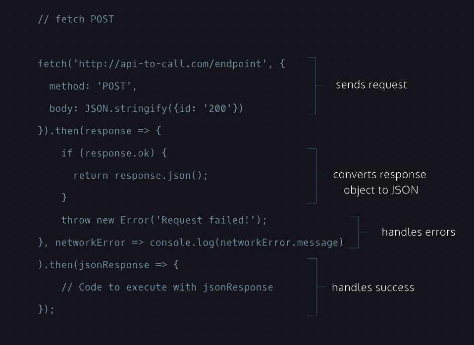
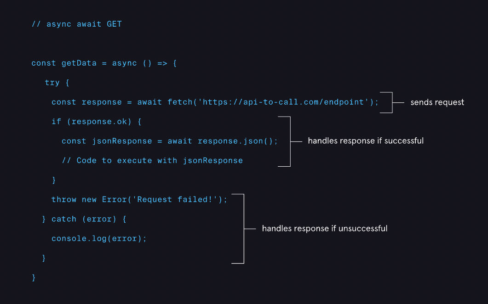
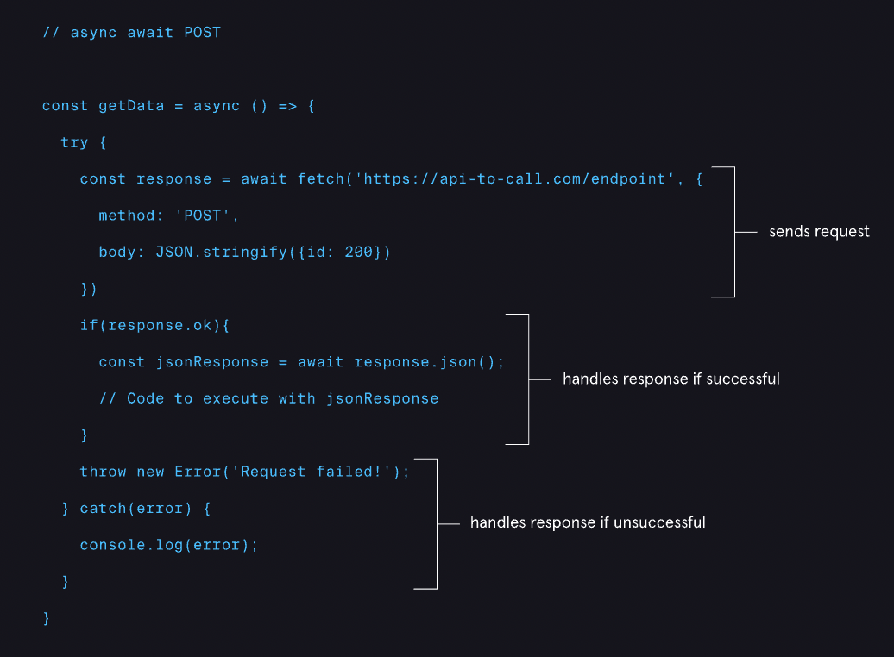

# REQUESTS WITH FETCH API

## Introduction to Requests with ES6
- There are many types of HTTP requests. The four most commonly used types of HTTP requests are GET, POST, PUT, and DELETE. In this lesson, we’ll cover GET and POST requests.

- With a GET request, we’re retrieving, or getting, information from some source (usually a website).

- For a POST request, we’re posting information to a source that will process the information and send it back.

- JavaScript uses an [event loop](https://developer.mozilla.org/en-US/docs/Web/JavaScript/EventLoop) to handle asynchronous function calls. When a program is run, function calls are made and added to a stack. The functions that make requests that need to wait for servers to respond then get sent to a separate queue. Once the stack has cleared, then the functions in the queue are executed.

---

## Intro to GET Requests using Fetch
- The first type of requests we’re going to tackle is GET requests using fetch().
  
- The fetch() function:

  1. Creates a request object that contains relevant information that an API needs.
  2. Sends that request object to the API endpoint provided.
  3. Returns a promise that ultimately resolves to a response object, which contains the status of the promise with information the API sent back.

- First, call the fetch() function and pass it a URL as a string for the first argument, determining the endpoint of the request.

- the.then() method is chained at the end of the fetch() function and in its first argument, the response of the GET request is passed to the callback arrow function. The .then() method will fire only after the promise status of fetch() has been resolved.
  
- Inside the callback function, the ok property of the response object returns a Boolean value. If there are no errors, response.ok will be true and the code will return response.json().
  
- If response.ok is a falsy value, our code will throw an error.
  
- A second argument passed to .then() will be another arrow function that will be triggered when the promise is rejected. It takes a single parameter, networkError. This object logs the networkError if we could not reach the endpoint at all (e.g., the server is down).

- A second .then() method will run after the previous .then() method has finished running without error. It takes jsonResponse, which contains the returned response.json() object from the previous .then() method, as its parameter and can now be handled, however we may choose.

---
## Making a GET Request
- [The Datamuse API](https://www.datamuse.com/api/) is a word-finding query engine for developers. It can be used in apps to find words that match a given set of constraints that are likely in a given context.
  
```
  fetch(endpoint, {cache: 'no-cache'}).then(response => {
    if (response.ok) {
      return response.json();
    }
    throw new Error('Request failed!');
  }, networkError => {
    console.log(networkError.message)
  })
}
```
---

## Handling a GET Request
- we will chain another .then() method, which will allow us to take the information that was returned with the promise and manipulate the webpage! 
  
- Note that if there is an error returns in the first .then() method, the second .then() method will not execute.

---
## Intro to POST Requests using Fetch
 

- Now, we’re going to learn how to use fetch() to construct POST requests!

- Notice that the fetch() call takes two arguments: an endpoint and an object that contains information needed for the POST request.

- The object passed to the fetch() function as its second argument contains two properties: method, with a value of 'POST', and body, with a value of JSON.stringify({id: '200'});.
  
- This second argument determines that this request is a POST request and what information will be sent to the API.
  
- A successful POST request will return a response body, which will vary depending on how the API is set up.
  
- The rest of the request is identical to the GET request. A .then() method is chained to the fetch() function to check and return the response as well as throw an exception when a network error is encountered. A second .then() method is added on so that we can use the response however we may choose.
  
---
## Making a POST Request
- In this exercise, we’re going to use that boilerplate code to shorten a URL using the [Rebrandly](https://developers.rebrandly.com/) URL Shortener API.

- We will need a [Rebrandly API key](https://app.rebrandly.com/links). To do this, read through the Rebrandly sign up guide to set up your API.


```
// Information to reach API
const apiKey = 'key';
const url = 'https://api.rebrandly.com/v1/links';

// Asynchronous functions make a post request
const shortenUrl = () => {
  const urlToShorten = inputField.value;
  const data = JSON.stringify({destination: urlToShorten})
  fetch(url,
  {method:'POST',
  headers:{
    'Content-type': 'application/json',
  'apikey': apiKey
  },body:data})
  }
```

---

## Handling a POST Request
- The request returns a Promise which will either be resolved or rejected.
  
- If the promise resolves, we can check and return that response.
  
- We will chain another .then() method and handle the returned JSON object and display the information to our webpage.
  
```
	fetch(url, {
    method: 'POST',
    headers: {
      'Content-type': 'application/json',
      'apikey': apiKey
    },
    body: data
  }).then(response=>{
    if(response.ok){
      return response.json();
    }throw new Error('Request failed!');
    }, networkError => {
    console.log(networkError.message)
    }).then((jsonResponse) => {
    renderResponse(jsonResponse)
  })

```
---
## Intro to async GET Requests
 

- The structure for this request will be slightly different. We will use the new keywords async and await, as well as the try and catch statements.
  
- Here are some key points to keep in mind as we walk through the code:

   - The async keyword is used to declare an async function that returns a promise.
  
  - The await keyword can only be used within an async function. await suspends the program while waiting for a promise to resolve.
  
  - In a try...catch statement, code in the try block will be run and in the event of an exception, the code in the catch statement will run.

- Study the async getData() function to the right to see how the request can be written using async and await.

--- 
## Intro to async POST Requests

 

- We still have the same structure of using try and catch as the async GET request we just learned about. But, in the fetch() call, we now have to include an additional argument that contains more information like method and body.
  
- The method property value is set to 'POST' to specify the type of request we are making. Then we have to include a body property with the value of JSON.stringify({id: 200}).

---
## Review

- GET and POST requests can be created in a variety of ways.
  
- We can use fetch() and async/await to asynchronous request data from APIs.
  
- Promises are a type of JavaScript object that represents data that will eventually be returned from a request.
  
- The fetch() function can be used to create requests and will return promises.
  
- We can chain .then() methods to handle promises returned by the fetch() function.
  
- The async keyword is used to create asynchronous functions that will return promises.
  
- The await keyword can only be used with functions declared with the async keyword.
  
- The await keyword suspends the program while waiting for a promise to resolve.
  
